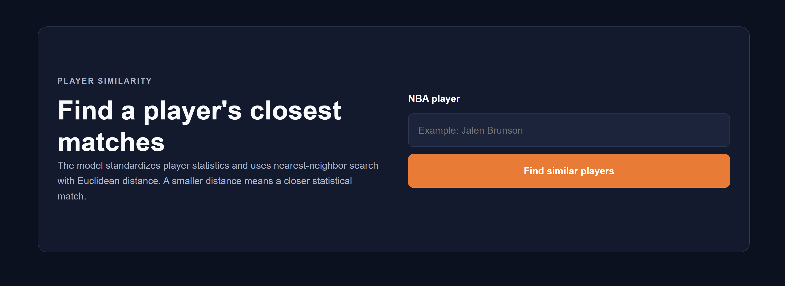
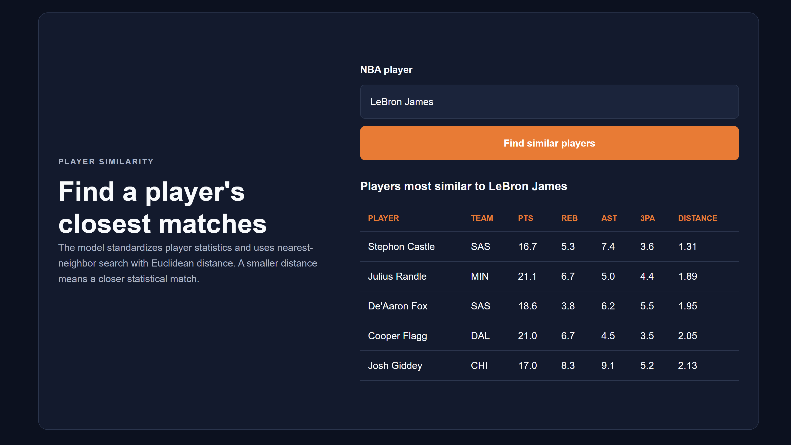
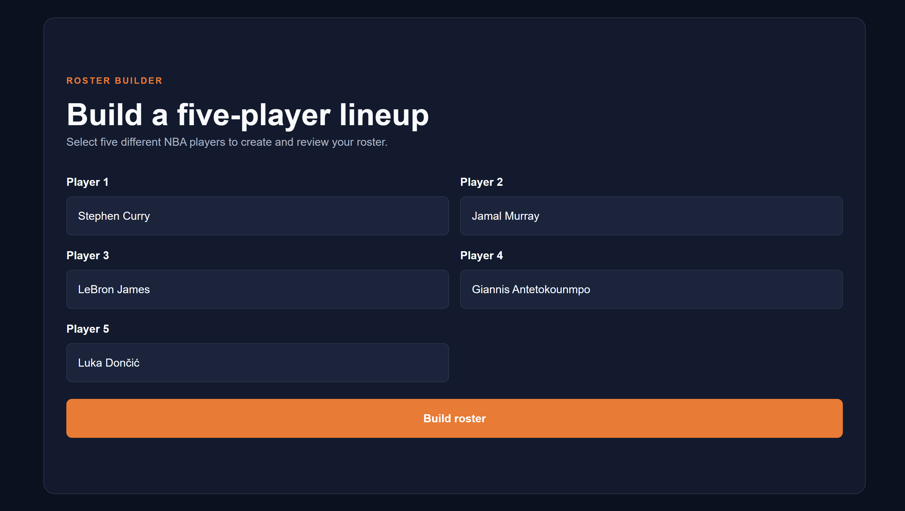
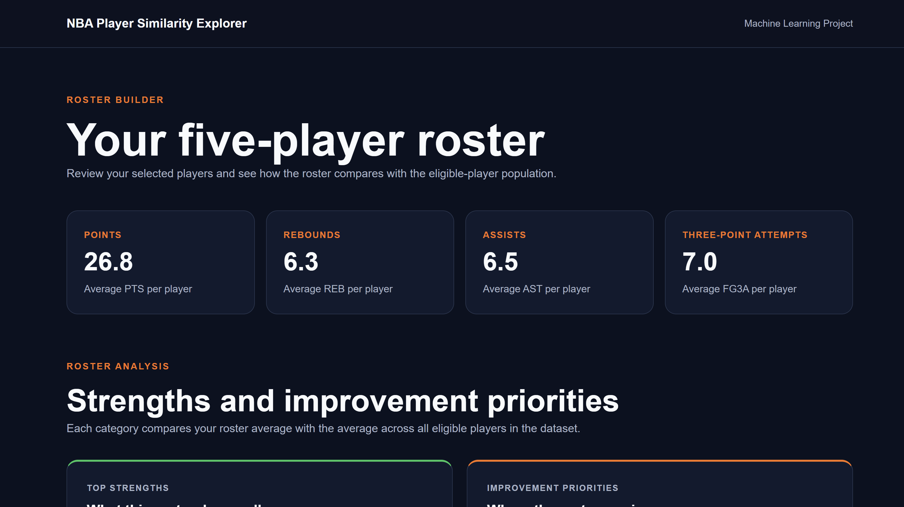
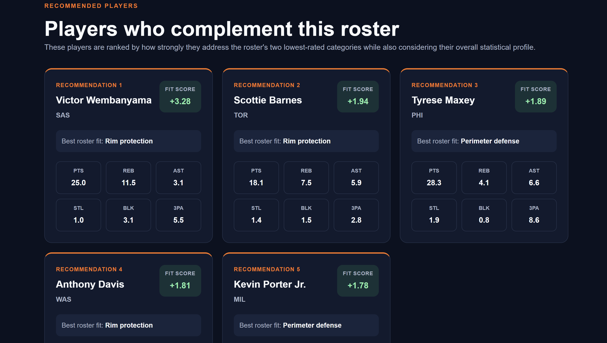

# NBA Player Similarity Explorer

A Flask and machine-learning web application that identifies statistically similar NBA players and recommends players who complement a five-player roster.

The application processes 2025–26 regular-season player statistics, compares players across selected performance categories, and analyzes roster strengths and weaknesses.

## Features

- Search for an NBA player by name
- Accept case-insensitive player searches
- Display the five most statistically similar players
- Build a five-player roster
- Prevent duplicate roster selections
- Calculate roster statistical averages
- Compare the roster across six performance categories
- Identify roster strengths and weaknesses
- Recommend players based on the roster's statistical needs
- Exclude players already selected for the roster
- Rank recommendations using a weighted fit score
- Display responsive results on desktop and mobile screens
- Handle missing data, invalid players, and incomplete rosters

## Screenshots

### Player Search



### Similarity Results



### Roster Builder



### Roster Analysis



### Player Recommendations



## Machine-Learning Approach

The player-similarity system uses numerical NBA performance statistics as player features.

The application:

1. Filters players who have played fewer than 10 games or averaged fewer than 10 minutes per game.
2. Selects 10 performance statistics for player comparison.
3. Uses `StandardScaler` to normalize the features so statistics with larger numerical ranges do not dominate the results.
4. Uses a nearest-neighbor model to identify players with the most similar statistical profiles.
5. Generates roster recommendations by weighting statistical categories in which the selected roster needs improvement.

The original dataset contains 582 players. After filtering, 441 qualified players remain for analysis.

## Technologies

- Python
- Flask
- pandas
- NumPy
- scikit-learn
- nba_api
- pytest
- HTML5
- CSS3
- JavaScript

## Project Structure

```text
nba-player-similarity-explorer/
├── app.py
├── ml/
│   ├── preprocess.py
│   ├── similarity.py
│   └── roster_recommender.py
├── scripts/
│   └── fetch_player_stats.py
├── static/
│   ├── css/
│   └── js/
├── templates/
├── tests/
│   ├── test_app.py
│   ├── test_roster_recommender.py
│   └── test_similarity.py
├── requirements.txt
├── README.md
├── LICENSE
└── .gitignore